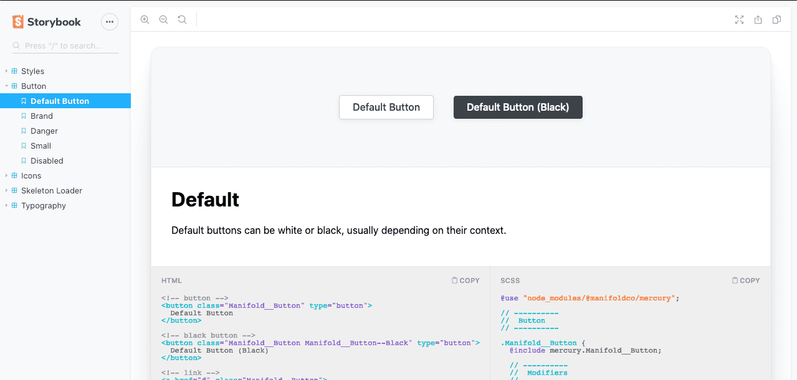

# ☤ Mercury

Design tokens auto-generated from our Figma files.

[][storybook]

## 💽 Usage

With [Node][node] installed, run the following in the project folder of your choice:

```bash
npm install @manifoldco/mercury
```

To view the component library:

[📚 **Visit Storybook**][storybook]

## Contributing

### 🏎️ Setup

```
npm install
npm run dev
```

### 🗿 How do I add new components?

Components live in the [`./src/components/`][local-components] folder, in `*.scss` files. To add a
new `widget` component:

1. Create a new **Sass `@mixin`** at `src/components/_widget.scss` using [our CSS
   styleguide][manifold-css]. Refer to the other `*.scss` files in that folder for reference.
1. Create a **Storybook Story** by making a new `stories/widget.stories.js` for the markup, and
   `stories/widget.scss` if needed. Refer to the other stories for reference.
1. **Document** the component as well as you can!

Some good things to keep in mind:

- The `*.scss` file you ship in `src/components` **will be shipped with Mercury.** Make sure it’s
  polished!
- ⚠️ Any Sass or CSS you add in `stories/*` **will NOT ship with Mercury.** Make sure that you
  didn’t accidentally leave essential styles in there!
- ⚠️ Only write `@mixin`s in Sass.These allow the consumer to pick the final CSS class names, and
  they also allow build CSS to tree-shake (important for Manifold Components).

When everything looks good, [open a PR](./pulls) and a member of the front-end team can review.

### 🚠 How do I hook more things up to Figma?

To understand the Figma updates, you’ll need to think in terms of **transformers** and **targets**.

We currently have the following **transformers** in Figma: `color`, `gradient`, `typography`, and
`shadow`. Each of those transformers in the [`./figma/transformers`][local-transformers] directory
map to a style namespace in Mercury. Each transformer takes the Figma REST API data (JSON), pulls
out what it needs for each, and converts the end result to a JS object.

After each transformer has generated its own object, each **target** is responsible for taking that
collection and converting it to a file output. Currently we have 2 targets: **JS** and **Sass**.
Each of those map to a file in [`./figma/targets`][local-targets]. The JS target is the simplest, as
it basically writes the object as-is from transformers. The Sass target has to do a little more
work, converting JS (`{ fontSize: '12px' }`) to CSS strings (`font-size: 12px;`), as well as
generating some wrappers (`@mixin Manifold__Typography { … }`). But overall, it’s not too much work.

_OK, but how do I add something?_ Your process from here will be somewhat trial-and-error, because
every “thing” you want to add will follow a different process (compare the `color` vs `typography`
transformers to see that they do different things). But your best helpers will be [The Figma REST
docs][figma-docs] to understand the data, as well as browsing [an export of the Figma JSON for
Manifold][figma-gist] to see what structure the API is returning (tip: save your own local copy of
the REST data if it’s changed drastically from that Gist).

In short: your goal is to trawl through the **meta** and **files** JSON that Figma provides, and
pull out what you need into a JS object (transformers) that can be exported to JS and Sass
(targets). Reach out to Drew if you need help.

### ♻️ Updating from Figma

Updating from Figma happens ✨ _automatically_ ✨ with a daily check. If you want to manually update
(perhaps you’re testing something), [create a Figma token][figma-docs-tokens] and add a new line to
your `~/.zshrc` or `~/.bashrc` (whichever exists on your machine; most likely the former):

```
export FIGMA_TOKEN=[token]
```

Then run:

```bash
npm run extract
```

### 🚀 Deploying to npm

npm deployment happens ✨ _automatically_ ✨ whenever Figma is updated.

In order to release versions yourself, you’ll have to do so manually. Locally, run:

```
make package
```

Update `pkg/package.json`’s `version` manually, and run:

```
cd pkg && npm publish --tag next
```

[figma-docs]: https://www.figma.com/developers/api
[figma-docs-tokens]: https://www.figma.com/developers/api#access-tokens
[figma-gist]: https://gist.github.com/dangodev/881ef0e9bc426579caba44d0c680ae7a
[local-components]: ./src/components
[local-icons]: ./src/icons
[local-releases]: ./releases
[local-scss]: ./src
[local-targets]: ./figma/targets
[local-transformers]: ./figma/transformers
[manifold-css]: https://app.gitbook.com/@manifold/s/engineering/codebases/ui/css-styleguide/
[node]: https://nodejs.org
[raw-loader]: https://github.com/webpack-contrib/raw-loader
[sass-modules]: https://sass-lang.com/blog/the-module-system-is-launched
[storybook]: https://mercury.manifold.now.sh
